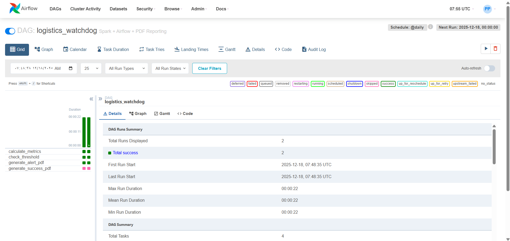

# 📦 Logistics Watchdog: Automated SLA Monitor



An automated data pipeline that monitors delivery performance in real-time. It uses **Apache Spark** to process order logs and **Apache Airflow** to orchestrate "Traffic Light" logic—triggering PDF alerts for the operations team if delivery times breach the SLA threshold (3 Days).

## Tech Stack
* **Orchestration:** Apache Airflow (2.7.1)
* **Processing:** PySpark (Apache Spark)
* **Infrastructure:** Docker & Docker Compose
* **Language:** Python 3.8

## How It Works
1.  **Ingest:** Spark reads raw order data (CSV) and filters for delivered items.
2.  **Calculate:** Computes the average time between `order_purchase` and `order_delivered`.
3.  **Decide:** Uses an Airflow `BranchPythonOperator` to check if `Avg > 3 Days`.
4.  **Act:**
    * **Breach:** Generates a "Critical Alert" PDF via `fpdf`.
    * **Normal:** Generates a standard daily report.

## How to Run

### 1. Prerequisites
* Docker Desktop installed and running.

### 2. Setup
Clone the repository:
```bash
git clone [https://github.com/alist2000/airflow-spark-watchdog.git](https://github.com/alist2000/airflow-spark-watchdog.git)
cd airflow-spark-watchdog
```
3. Build & Start Infrastructure
This command builds the custom Docker image (installing Java/Spark dependencies) and starts the containers:

```bash
docker-compose up --build -d
```

4. Initialize Database (First Time Only)
Important: You must initialize the Airflow database and create an admin user manually on the first run, or the webserver will exit.

```bash
# 1. Initialize the tables
docker-compose run airflow-webserver airflow db init

# 2. Create the admin user
docker-compose run airflow-webserver airflow users create \
    --username admin \
    --firstname Peter \
    --lastname Parker \
    --role Admin \
    --email admin@example.com \
    --password admin

# 3. Restart services to apply changes
docker-compose restart
```

5. Access the Pipeline
Go to http://localhost:8080.

Login with admin / admin.

Trigger the logistics_watchdog DAG.

Check the "Graph" view to see the pipeline branching logic in action.